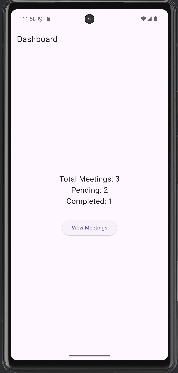
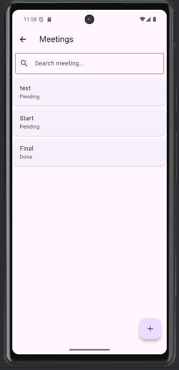
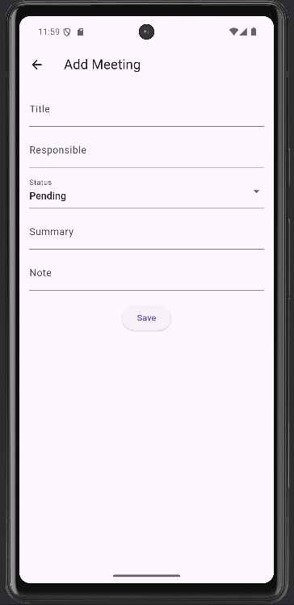
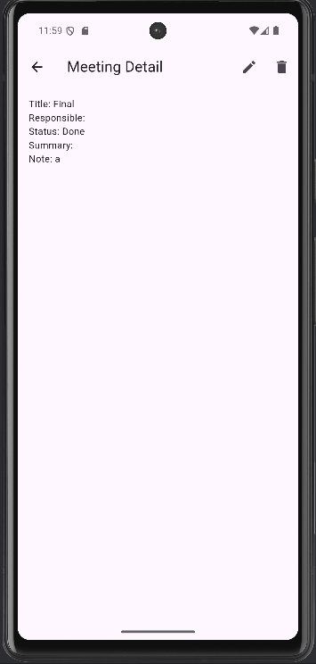
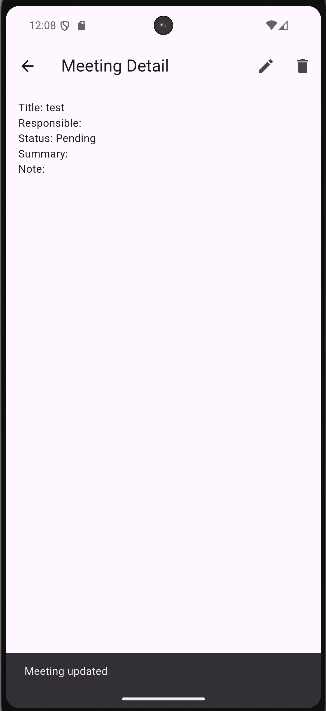
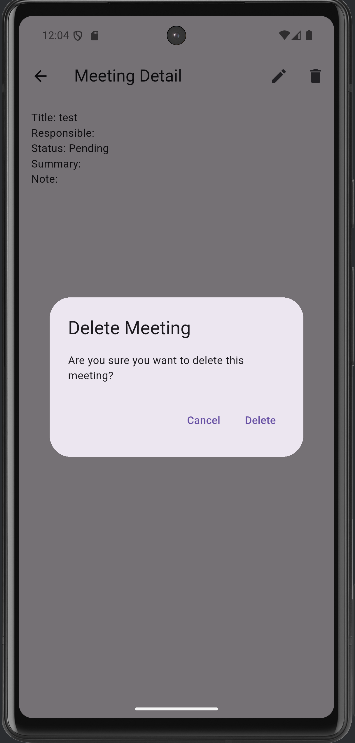
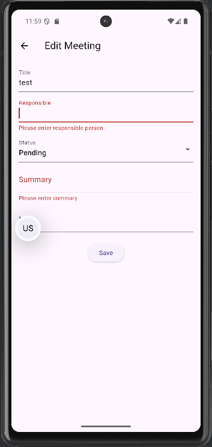

# Meeting Management Application

## Project Title
Meeting Management Application (Flutter + Provider + SQLite)

## Author
Name: Nattapong Jansing  
Student ID: 67543210068-2

---

# Application Description

This application is a mobile app developed using **Flutter** for managing meeting records.  
Users can create, view, update, and delete meeting information stored in a **SQLite local database**.  
The app also provides a dashboard that summarizes meeting statistics.

---

# Application Features

1. Dashboard Screen
   - Display total meetings
   - Display pending meetings
   - Display completed meetings

2. Meeting List
   - Show all meetings stored in the database
   - Search meeting by title or responsible person

3. Add Meeting
   - Create a new meeting record
   - Form validation prevents empty fields

4. Edit Meeting
   - Update meeting information

5. Delete Meeting
   - Confirmation dialog before deleting

6. Meeting Detail
   - Show detailed meeting information

---

# Database Structure

This application uses **SQLite** as a local database.

Table: `meetings`

| Field | Type | Description |
|------|------|-------------|
| id | INTEGER | Primary key |
| title | TEXT | Meeting title |
| date | TEXT | Meeting date |
| responsible | TEXT | Responsible person |
| status | TEXT | Meeting status (Pending / Done) |
| summary | TEXT | Meeting summary |
| note | TEXT | Additional note |

---

# Simple ER Diagram

```
Meeting
------------------------
id (PK)
title
date
responsible
status
summary
note
```

---

# Packages Used

The following packages are used in this project:

```
provider
sqflite
path
```

Explanation:

- **provider** → state management  
- **sqflite** → SQLite local database  
- **path** → manage database file path  

---

# Project Structure

```
lib
│
├── models
│   └── meeting.dart
│
├── providers
│   └── meeting_provider.dart
│
├── services
│   └── database_helper.dart
│
├── screens
│   ├── home_screen.dart
│   ├── list_screen.dart
│   ├── add_edit_screen.dart
│   └── detail_screen.dart
│
├── widgets
│   └── meeting_card.dart
│
└── main.dart
```

---

# Screenshots

## Dashboard


## Meeting List


## Add Meeting


## Detail Screen


## Edit Form


## Delete Confirmation


## Validation (Empty Field Protection)


---

# How to Run the Project

1. Clone the repository

```
git clone https://github.com/0rea/EX_ENGSE608.git
```

2. Install dependencies

```
flutter pub get
```

3. Run the application

```
flutter run
```

---

# APK File

APK file can be built using the command:

```
flutter build apk
```

The APK file will be located in:

```
build/app/outputs/flutter-apk/app-release.apk
```

---

# GitHub Repository

https://github.com/0rea/EX_ENGSE608